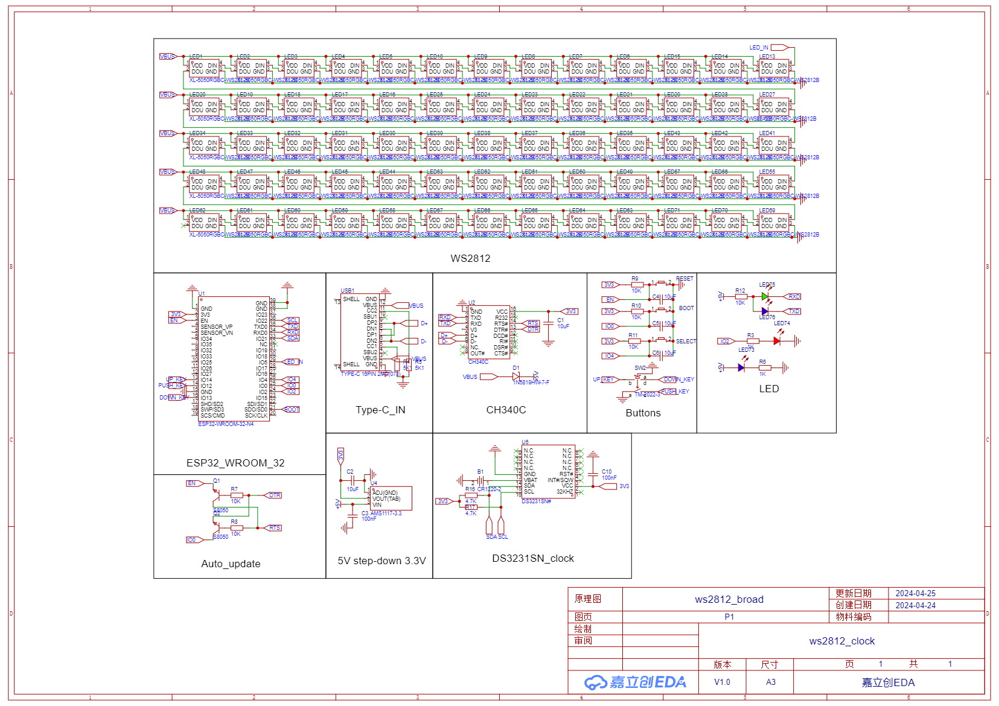
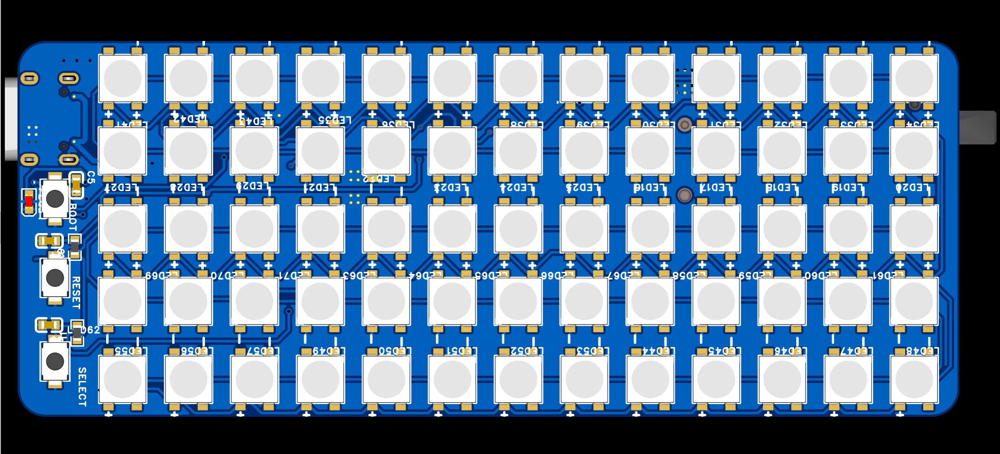
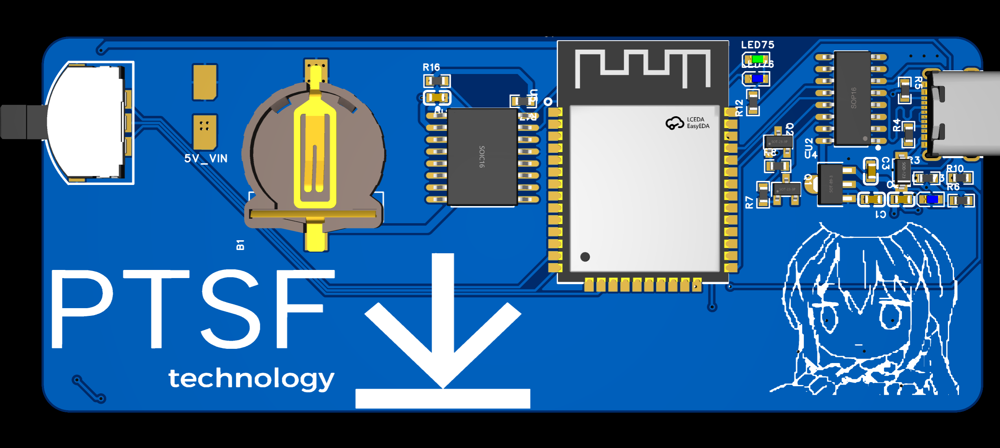
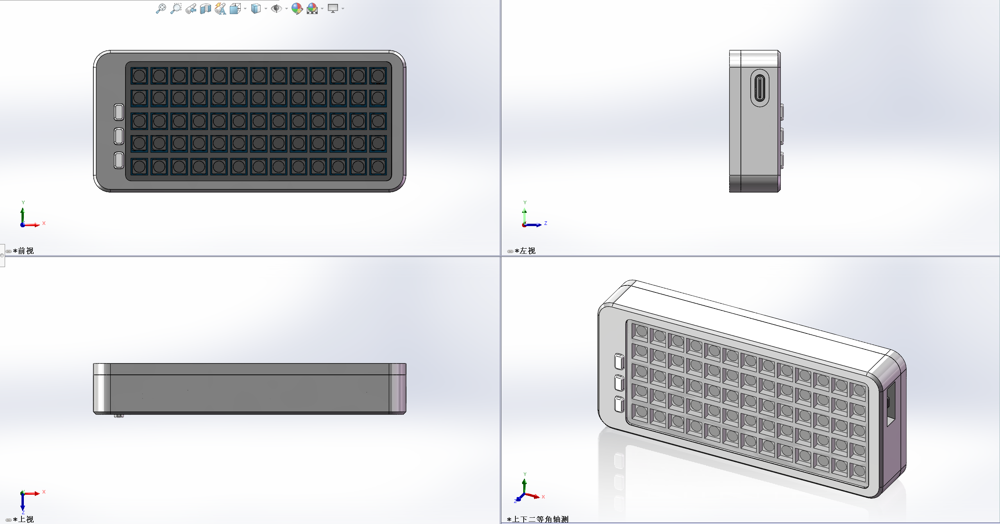
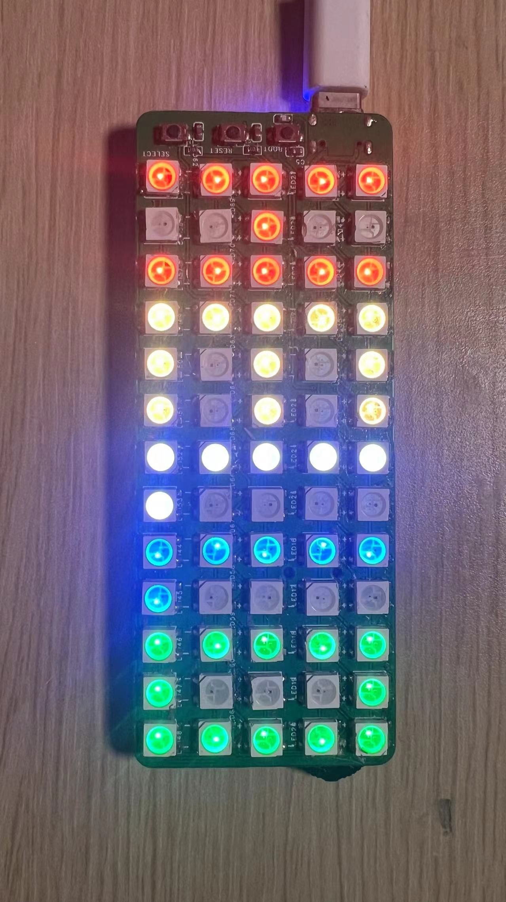
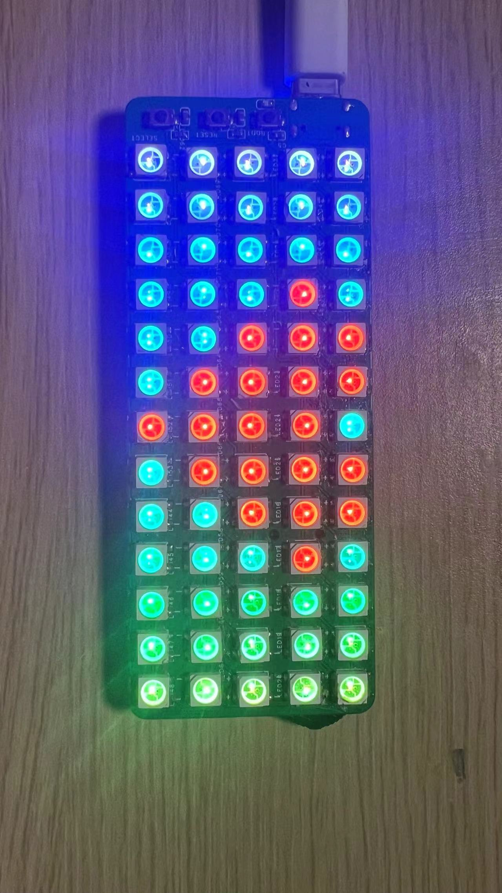
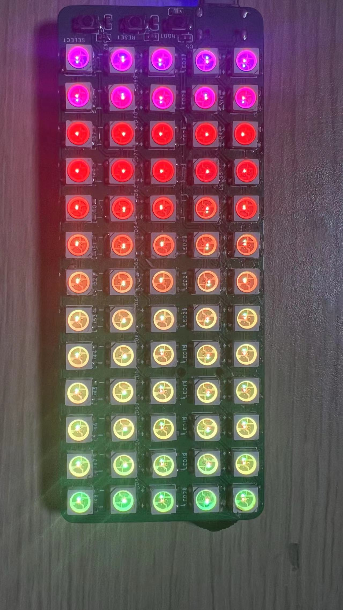
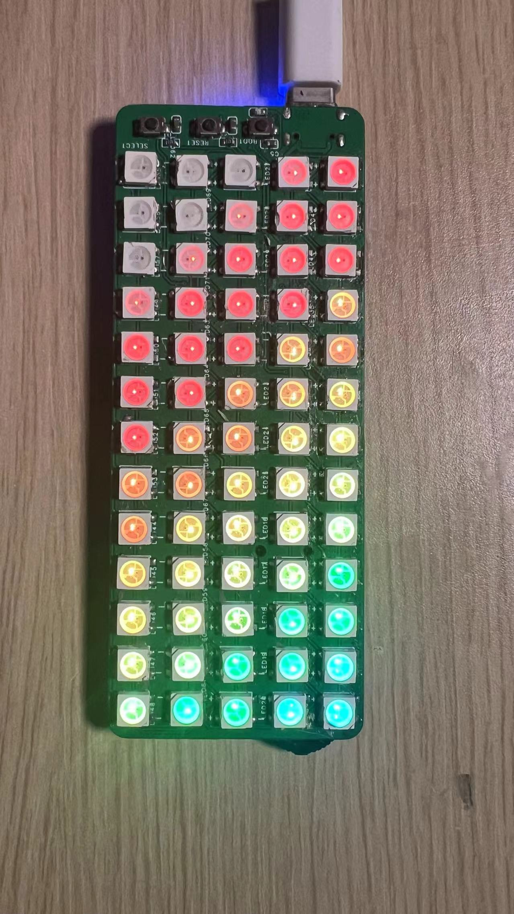
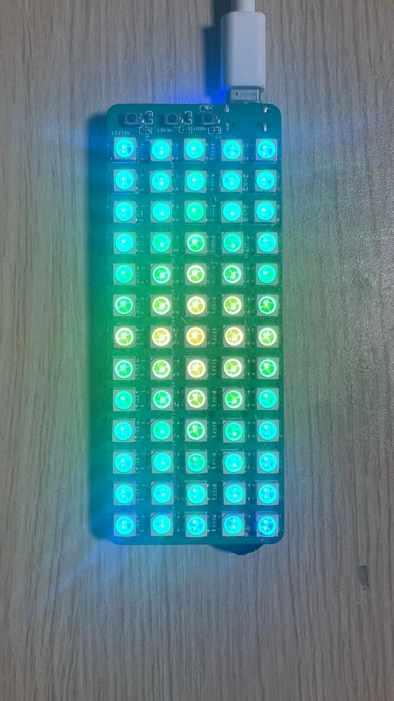

# WS2812_RGB_clock

**PCB design**

Since the design is not mature enough, this is the first board.

Record my production process, and I hope never forget my original intention.

**MODEL design**

**display**

https://github.com/ptsfdtz/WS2812_LED_CLOCK/assets/148436840/9a490b34-cae3-49a7-b0c5-d45164b7b41f

